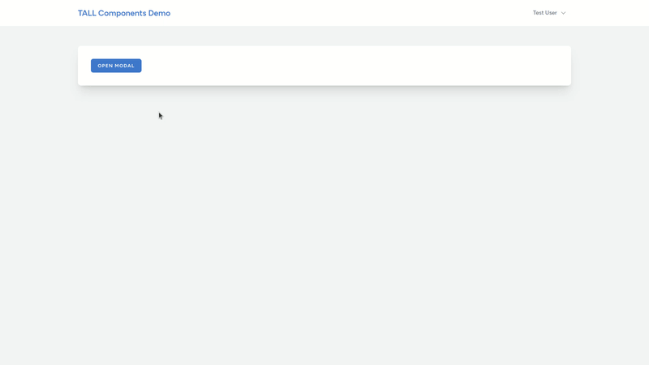
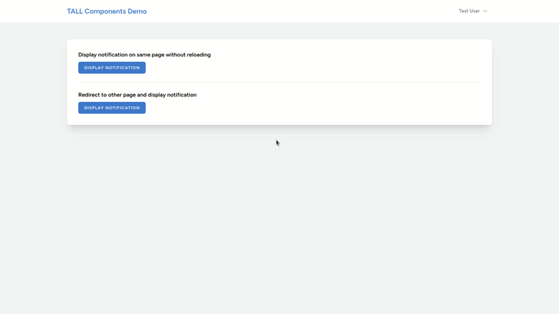
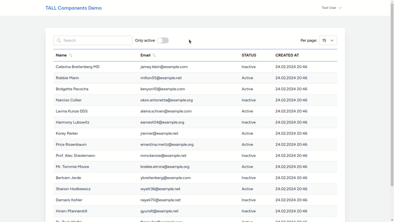
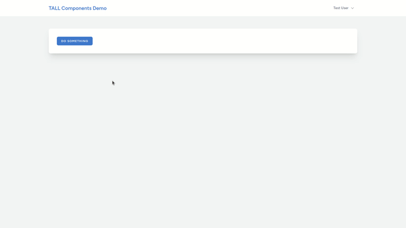

# TALL components

Library of useful UI components created for TALL (Tailwind CSS, Alpine.js, Laravel, Livewire) stack.

Include:

- [x] [Modal](#modal)
- [x] [Confirmation modal](#confirmation-modal)
- [x] [Notification](#notification)
- [x] [Table (search, filters, sort columns)](#table)
- [x] [Loading spinner](#loading-spinner)
- [ ] Drag & drop file upload (Filepond)
- [ ] Markdown editor (Quill)
- [ ] Datetime picker (Flatpickr)
- [ ] Show/hide password input
- [ ] Auto generate slug

## Requirements

This package requires having installed and working Laravel, Tailwind CSS, Alpine.js and Livewire.

The package is created and tested for these frameworks:
- Laravel v10
- Tailwind CSS v3
- Alpine.js v3
- Livewire v3

There can be some differences for other versions.

## Installation

You can install the package via composer:

```bash
composer require vojislavd/tall-components
```

Next, you should compile assets:
```bash
npm install && npm run build
```

Components will use `primary`, `primary-dark`, `secondary` and `secondary-dark` colors. You should configure these colors in your `tailwind.config.js` file.

If you want to change colors or customize anything else, you can publish all components views with:

```bash
php artisan vendor:publish --tag="tall-components-views"
```

To change colors, just find `primary`, `primary-dark`, `secondary` or `secondary-dark` in the component and replace them with color you want to use.

## Usage

### Modal



To use modal, you need have boolean variable inside your Livewire component. Modal will be opened or closed based on the value of that variable.

```php
<?php

namespace App\Livewire;

use Livewire\Component;

class MyComponent extends Component
{
    public bool $openModal = false;
}
```

In blade file of the same Livewire component, you should add `<x-tc::modal>` and set `model` property to match boolean variable you added in the PHP file of your Livewire component.

Inside `<x-tc::modal>` tags, you can add any content you want to be present in modal.

```blade
<x-tc-modal model="openModal">
    <h1>This is some title</h1>

    <p>This is some content</p>
</x-tc-modal>
```

The modal can be opened from the blade file, like this:

```blade
<button type="button" wire:click="$set('openModal', true)">
    Open my modal
</button>
```

Or it can be opened from a PHP file, like this:

```php
<?php

namespace App\Livewire;

use Livewire\Component;

class MyComponent extends Component
{
    public bool $openModal = false;

    public function someAction()
    {
        // do something

        $this->openModal = true;
    }
}
```

The same goes for closing the modal, only the value of `openModal` will be set to `false`.

For example, if you want to have a button to close the modal inside the modal itself, you can do it like this:

```blade
<x-tc-modal model="openModal">
    ... Some content of modal

    <button type="button" wire:click="$set('openModal', false)">
        Cancel
    </button>
</x-tc-modal>
```

It's possible to configure the width of the modal by passing a Tailwind CSS class to `width` property of the component. For example:

```blade
<x-tc-modal model="openModal" width="w-1/2">
    ... Some content of modal
</x-tc-modal>
```

You can add action buttons to the bottom of the modal like this:

```blade
<x-tc-modal model="openModal">
    ... Some content of modal

    <x-slot::action>
        <button>Cancel</button>
        <button>Submit</button>
    </x-slot::action>
</x-tc-modal>
```

### Confirmation modal


To use the confirmation modal, you need to add the `x-tc-confirmation-modal` component and the `WithTcConfirmation` trait to the Livewire component where you want to use it.

```php
<?php

namespace App\Livewire;

use Livewire\Component;
use TallComponents\Livewire\Traits\WithTcConfirmation;

class MyComponent extends Component
{
    use WithTcConfirmation;
}
```
```blade
<x-tc-confirmation-modal />
```

Then, to require confirmation for some action, you should add `x-tc-confirm` to the button from which you want to trigger the confirmation modal and pass `title`, `message`, and `action`.

`action` should be a Livewire method you want to call after the user clicks the "Confirm" button in the modal.

```blade
<button 
    type="button" 
    x-tc-confirm="{ 
        title: 'Delete user', 
        message: 'Are you sure you want to delete this user?', 
        action: 'deleteUser' 
    }
>
    Delete user
</button>
```

While the `title` parameter is optional, `message` and `action` are required, and the component will not work without them.

If you want to use the confirmation modal with multiple actions on the same Livewire component, it's enough to add it only once. Alternatively, if you want to have it on all pages, you can include it in your layout file. Just make sure you have the `WithTcConfirmation` trait in your Livewire component.

### Notification



You can display notifications on the same page without reloading, or you can redirect to some other page and display notifications on that page.

To use notifications, the recommended way is to add them to your layout file, so notifications will be available on all pages.

You should add this Livewire component at the end of the file, before `@livewireScripts`.

```blade
@livewire('tc-notification)

// or

<livewire:tc-notification>
```

If you want to display notifications from a Livewire component without reloading the page, all you need to do is dispatch `notification` event with the message you want to display, like this:

```php
<?php

namespace App\Livewire;

use Livewire\Component;

class MyComponent extends Component
{
    public function someAction()
    {
        // do something

        $this->dispatch('notification', 'Message to display in notification');
    }
}
```

If you want to redirect to some other page and display a notification there, you can do it like this:

```php
<?php

namespace App\Livewire;

use Livewire\Component;

class MyComponent extends Component
{
    public function someAction()
    {
        // do something

        return to_route('some-route-name')
            ->with('notification', 'Message to display in notification');
    }
}
```

Notification will disappear by default after 5 seconds (5000 ms). To change that, you need to pass the duration parameter to the component. Duration is represented in milliseconds.

For example, to change the notification to disappear after 3 seconds, you can do it like this:

```blade
@livewire('tc-notification, ['duration' => 3000])

// or

<livewire:tc-notification :duration="3000">
```

### Table



You can use a table in the blade file of your Livewire component like this:

```blade
<x-tc-table>
    <x-slot:search></x-slot:search>

    <x-slot:filters>
        <x-tc-switcher wire:model.live="onlyActive" label="Only active" />
    </x-slot:filters>

    <x-slot:per-page>
        <x-tc-per-page :options="[5, 15, 30]" />
    </x-slot:per-page>

    <x-slot:heading>
        <x-tc-th sortable="name">
            Name
        </x-tc-th>
        <x-tc-th sortable="email">
            Email
        </x-tc-th>
        <x-tc-th>
            Status
        </x-tc-th>
        <x-tc-th>
            Created at
        </x-tc-th>
    </x-slot:heading>

    @forelse($this->users as $user)
        <x-tc-tr href="{{ route('users.show', $user) }}" :index="$loop->index">
            <x-tc-td>
                {{ $user->name }}
            </x-tc-td>
            <x-tc-td>
                {{ $user->email }}
            </x-tc-td>
            <x-tc-td>
                {{ $user->status }}
            </x-tc-td>
            <x-tc-td>
                {{ $user->created_at->format('d.m.Y H:i') }}
            </x-tc-td>
        </x-tc-tr>
    @empty
        <x-tc-tr>
            <x-tc-td colspan="4">
                There is no results
            </x-tc-td>
        </x-tc-tr>
    @endforelse 

    <x-slot:pagination>
        {{ $this->users->links() }}
    </x-slot:pagination>
</x-tc-table>
```

And in Livewire component, you need to add the `WithTcTable` trait. When you are getting rows for the table (such as `$this->users` in this example), you can use filters like this:

```php
<?php

namespace App\Livewire;

use App\Models\User;
use Livewire\Attributes\Computed;
use Livewire\Component;
use TallComponents\Livewire\Traits\WithTcTable;

class MyComponent extends Component
{
    use WithTcTable;

    public bool $onlyActive = false;

    #[Computed]
    public function users(): LengthAwarePaginator|Model
    {
        return User::query()
            ->when($this->tcSearch, function ($query) {
                $query->where('name', 'LIKE', '%' . $this->tcSearch . '%');
            })
            ->when($this->onlyActive, function ($query) {
                $query->where('is_active', true);
            })
            ->when($this->tcSortable === 'name', function ($query) {
                $query->orderBy('name', $this->tcSortDirection);
            })
            ->when($this->tcSortable === 'email', function ($query) {
                $query->orderBy('email', $this->tcSortDirection);
            })
            ->paginate($this->tcPerPage);
    }
}
```
#### Clickable rows
It is possible to allow rows to be clickable by adding the `href` attribute to the `x-tc-tr` component and passing the value where you want to be redirected.

For example, to redirect to the user profile page with the route name `users.show`, you can do it like this:

```blade
<x-tc-tr :href="route('users.show', $user)" :index="$loop->index">
```

#### Search filter
Search filter is optional; if you don't need it, you can leave out `<x-slot:search></x-slot:search>`. In that case, there will be no input for searching the table.

The value of the search input is stored in the `tcSearch` variable. So, to filter the table based on the value from that field, you need to use `$this->tcSearch`.

#### Custom filters
You can add any custom filter you want (In the case above, it's the `Only active` filter). You can pass any toggle, checkbox, or select input inside the `<x-slot:filters>` slot.

#### Per page filter
Per page filter is optional; if you don't need it, you can leave out `<x-slot:per-page>`.


The value of per page is stored in the `tcPerPage` variable, and it is `15` by default. To use it, you need to pass `$this->tcPerPage` to your `paginate` method, like this:

```php
...
->paginate($this->tcPerPage);
```

You can customize the number of rows users can choose by passing values as the `options` attribute to the `x-tc-per-page` component. For example, if you want to allow users to choose between `15`, `30`, and `50`, you can do it like this:

```blade
<x-slot:per-page>
    <x-tc-per-page :options="[15, 30, 50]" />
</x-slot:per-page>
```

#### Sort by columns
You can allow sorting by any column in the table by adding `sortable` to the `<x-tc-th>` component and by passing the key for sorting, which you will use in Livewire components.

For example, if you want to allow sorting by user name, you can do it like this:

```blade
<x-tc-th sortable="name">
    Name
</x-tc-th>
```

And then you can sort results based on name like this:

```php
...
->when($this->tcSortable === 'name', function ($query) {
    $query->orderBy('name', $this->tcSortDirection);
})
```
Name of the sortable column is stored in `tcSortable`, and direction is stored in the `tcSortDirection` variable. Direction will be `asc` by default and will switch between `asc` and `desc` on every click.

#### Pagination
Pagination is optional; if you don't need it, you can leave out `<x-slot:pagination></x-slot:pagination>`.

### Loading spinner



Add `<x-tc-loading-spinner />` to your blade and add a `target` attribute that should match the Livewire action you want to use the spinner for.

```blade
<x-tc-loading-spinner target="someAction" />
```

```php
<?php

namespace App\Livewire;

use Livewire\Component;

class MyComponent extends Component
{
    public function someAction()
    {
        // Display spinner while this method executing
    }
}
```

If you want to change the style of the spinner, you can add a `class` with the changes you want to implement.

For example, you can change the size of the spinner like this:

```blade
<x-tc-loading-spinner target="someAction" class="!w-10 !h-10" />
```

Or if you want to make some other changes, you can publish the view file and do it there.

## Testing
Run tests with:

```bash
composer test
```

## Credits

- [Vojislav Dragicevic](https://vojislavd.com/)

## License

The MIT License (MIT). Please see [License File](LICENSE.md) for more information.
